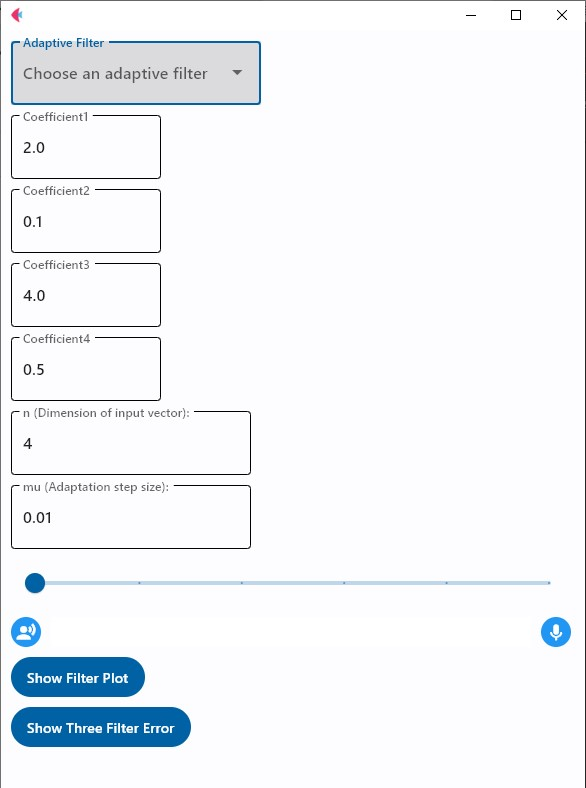
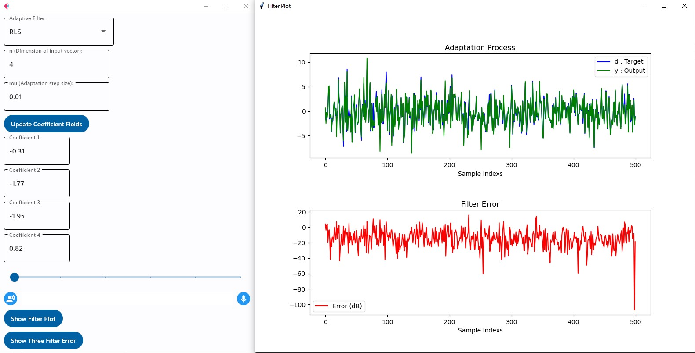
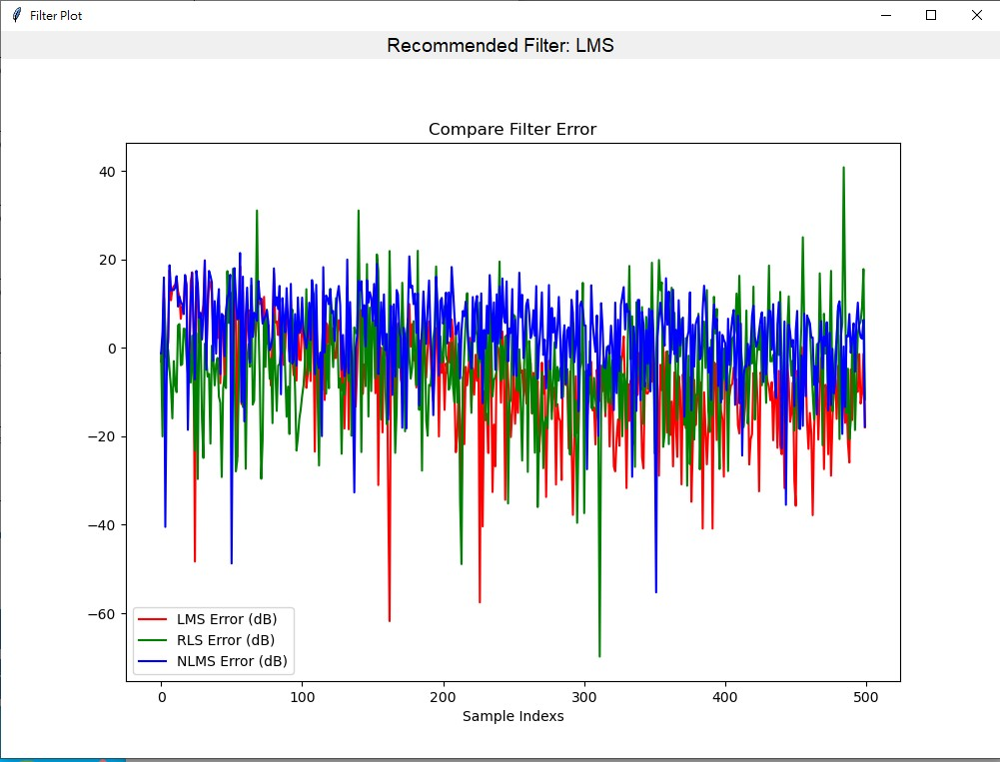

# 濾波器於模擬語音降噪之效果比較

這是一個以 Python 開發的圖形化應用程式，結合 [Flet](https://flet.dev/)、[Tkinter](https://docs.python.org/3/library/tkinter.html) 和 [padasip](https://matousc89.github.io/padasip/)，實現 **LMS、RLS、NLMS** 三種Adaptive Filter的模擬與比較。

---

## 功能特色

- **語言**：Python 3
- **用途**：模擬使用含噪音的訊號通過濾波器的適應過程與誤差圖
- **特色**：
- 提供三種Adaptive Filter：LMS、RLS、NLMS
- 可自訂濾波器之學習率及係數
- 顯示：
  - 濾波器適應過程圖（目標值Target與輸出值Output）
  - 濾波誤差圖（以 dB 為單位）
- 可同時比較三種濾波器的平均誤差並推薦最佳濾波器
- 提供調整聲源與收音距離，模擬不同情況下製造的噪音和濾波效果

## 使用方式

- 選擇濾波器類型（LMS / RLS / NLMS）
- 設定維度n與學習率mu
- 點選 "Update Coefficient Fields" 產生對應的係數欄位
- 點選 "Show Filter Plot" 查看單一濾波器的適應過程（目標值與預測值）
- 點選 "Show Three Filter Error" 比較 LMS、RLS、NLMS 的誤差，並顯示推薦濾波器

---
## 程式畫面及圖表顯示

### GUI

### 單一濾波器模擬結果

### 三種濾波器誤差比較

